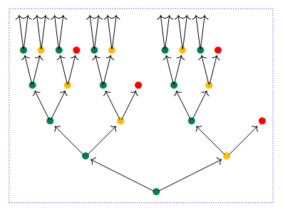

# PolyTT 🦜

<p align="center">
  
</p>

A type theory with native support for [Polynomial Functors](https://topos.site/poly-book.pdf).

For examples, see `std-lib/Tutorial.poly`.

# Building

Install `opam` using our preferred package manager. On Mac you can install it with `homebrew` via:
```bash
$ brew install opam
```

Once you have `opam` you can install all the dev dependencies and then build `polytt`:

```bash
$ opam init
$ opam switch create . ocaml-base-compiler.5.0.0
$ opam install --deps-only --locked .
$ dune build
```

Alternatively, `flake.nix` file is provided to setup an entire development environment with `nix`:

```
$ nix develop
```

# Running

```bash
$ dune exec polytt std-lib/Tutorial.poly
```


# References
 
- [A reference for categorical structures on Poly](https://arxiv.org/abs/2202.00534 )
- [Polynomial Functors: A General Theory of Interaction](https://topos.site/poly-book.pdf)
